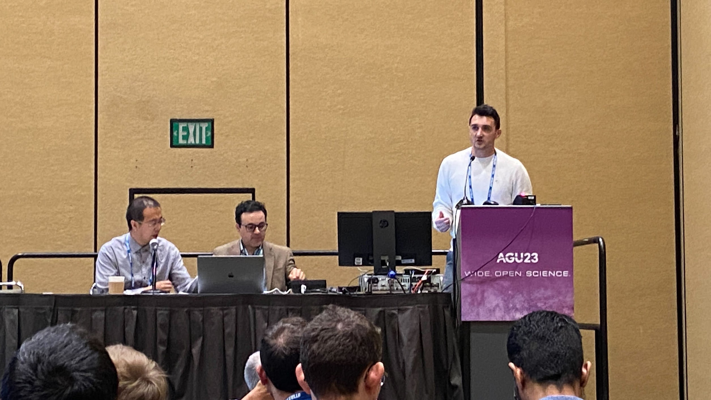

# Tadd Bindas

<figure markdown="span">
  { width="600" }
</figure>

Large-Scale hydrological modeler. Author of $\delta$MC, and lab member of the [Multiscale Hydrologic Processes and Intelligence](https://mhpi.github.io/) group at Penn State. Developer at Earth Resources Technologies working to [improve flood predictions.](https://www.noaa.gov/news-release/biden-harris-administration-announces-80-million-to-improve-water-predication-capabilities)

## Presentations

<div class="grid" markdown>

=== ":computer: Workshops"

    * __ML basics: Linear Regression and Recurrent Deep Networks for Hydrologic Applications__
        * _CIROH 1st annual Developers and Training Conference_ (Salt Lake City, UT 2023)

=== ":material-email-newsletter: Keynotes/Invited Talks"

    * __Improving Large-Basin River Routing Using a Differentiable Muskingum-Cunge Model and Physics-Informed Machine Learning__ 
        * _CIROH 1st annual Developers and Training Conference_ (Salt Lake City, UT 2023)

=== ":speech_left: Oral Talks"

    * __Enhanced Continental Runoff Prediction through Differentiable Muskingum-Cunge Routing ($\delta$MC-CONUS-hydroDL2)__
        * _The European Geophysical Union General Assembly_ (Vienna, Austria 2024)
    * __Expanding Differentiable Muskingum-Cunge River Routing: Moving from the catchment-scale to continental-scale__
        *_The American Geophysical Union Fall Meeting_ (San Fransisco, CA 2023)
    * __On Numerical Methods and Differentiable Modeling for Soil Process Representations in the NextGen Framework in Arid Regions__
        * _2023 National Water Center Summer Institute Capstone_ (Tuscaloosa, AL 2023)
    * __Improving Large-Basin River Routing Using a Differentiable Muskingum-Cunge Model and Physics-Informed Machine Learning__
        * _The European Geophysical Union General Assembly_ (Vienna, Austria 2023)
    * __Routing Flood Waves Through the River Network Utilizing Physics-Guided Machine Learning and the Muskingum-Cunge Method__
        * _The American Geophysical Union Fall Meeting_ (Online Meeting 2020)
    

=== ":material-human-male-board: Posters"

    * __Improving Large-Basin Streamflow Simulation Using a Differentiable, Learnable Routing Model__
        * _The American Geophysical Union Fall Meeting_ (Chicago, IL 2022)
    * __Improving Large-Basin Streamflow Simulation Using a Differentiable, Learnable Routing Model__
        * _HydroML (Inaugural Symposium)_ (State College, PA 2022)
    * __Discovering Localized River Parameters via Physics-Guided Machine Learning and the Muskingum-Cunge Method__
        * _The American Geophysical Union Fall Meeting_ (New Orleans, LA 2021)
    * __Road Salts, and Faults: Evidence for Preferential Transport of High Salinity Groundwater via Geologic Structures That Connect Highways to Streams__
        * _The American Geophysical Union Fall Meeting_ (San Fransisco, CA 2019)
    * __dpLGAR: a differentiable parameter learning implementation of the Layered Green & Ampt with redistribution (LGAR) model__
        * _The American Geophysical Union Fall Meeting_ (San Fransisco, CA 2023)


</div>

## Featured Publications

### Improving River Routing Using a Differentiable Muskingum-Cunge Model and Physics-Informed Machine Learning

!!! info

    To view this paper's Github Code, see the Github URL at the top-right of the nav bar. 

A novel differentiable modeling framework to perform routing and to learn a “parameterization scheme” (a systematic way of inferring parameters from more rudimentary information) for routing flows on the river network.

Below are the main points from the paper:

- A novel differentiable routing model can learn effective river routing parameterization, recovering channel roughness in synthetic runs.
- With short periods of real training data, we can improve streamflow in large rivers compared to models not considering routing.
- For basins >2,000 km2, our framework outperformed deep learning models that assume homogeneity, despite bias in the runoff forcings.

```bibtex
@article{bindas2024improving,
  title={Improving River Routing Using a Differentiable Muskingum-Cunge Model and Physics-Informed Machine Learning},
  author={Bindas, Tadd and Tsai, Wen-Ping and Liu, Jiangtao and Rahmani, Farshid and Feng, Dapeng and Bian, Yuchen and Lawson, Kathryn and Shen, Chaopeng},
  journal={Water Resources Research},
  volume={60},
  number={1},
  pages={e2023WR035337},
  year={2024},
  publisher={Wiley Online Library}
}
```

### Differentiable modelling to unify machine learning and physical models for geosciences

A description of specific method of physics-informed machine learning. In this approach, we implement a physics equation using a differentiable coding platform, then use embedded NNs to estimate parameters. The embedded NNs are then tuned through the differentiable physics function, constraining the NNs with physics. 

``` bibtex
@article{shen_differentiable_2023,
	title = {Differentiable modelling to unify machine learning and physical models for geosciences},
	volume = {4},
	copyright = {2023 Springer Nature Limited},
	issn = {2662-138X},
	url = {https://www.nature.com/articles/s43017-023-00450-9},
	doi = {10.1038/s43017-023-00450-9},
	language = {en},
	number = {8},
	urldate = {2023-08-22},
	journal = {Nature Reviews Earth \& Environment},
	author = {Shen, Chaopeng and Appling, Alison P. and Gentine, Pierre and Bandai, Toshiyuki and Gupta, Hoshin and Tartakovsky, Alexandre and Baity-Jesi, Marco and Fenicia, Fabrizio and Kifer, Daniel and Li, Li and Liu, Xiaofeng and Ren, Wei and Zheng, Yi and Harman, Ciaran J. and Clark, Martyn and Farthing, Matthew and Feng, Dapeng and Kumar, Praveen and Aboelyazeed, Doaa and Rahmani, Farshid and Song, Yalan and Beck, Hylke E. and Bindas, Tadd and Dwivedi, Dipankar and Fang, Kuai and Höge, Marvin and Rackauckas, Chris and Mohanty, Binayak and Roy, Tirthankar and Xu, Chonggang and Lawson, Kathryn},
	month = aug,
	year = {2023},
	note = {Publisher: Nature Publishing Group},
	keywords = {Hydrology, Ecology, Climate sciences, Environmental sciences, Natural hazards, /unread},
	pages = {552--567},
}
```
